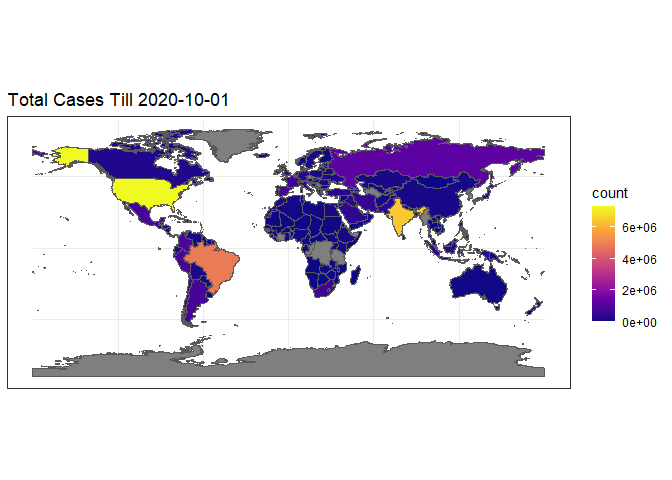
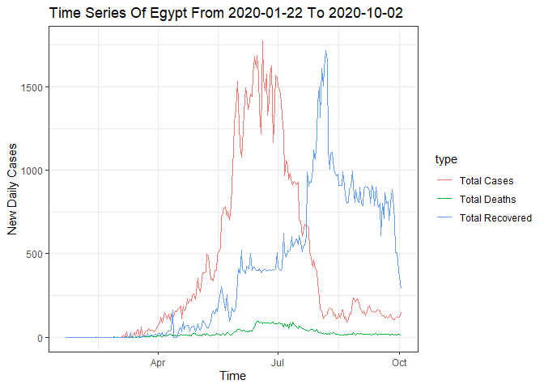

<!-- README.md is generated from README.Rmd. Please edit that file -->

# covidPlots 

# covidPlots

<!-- badges: start -->

<!-- badges: end -->

This package gives an overview of the covid-19 situation in the world.

## Installation

Unfortunately you can’t install this package from CRAN. So you will have
to rely on github\!

``` r
# install.packages("devtools")
devtools::install_github("Iarima/covidPlots")
```

## Example

This package has three functions. First one returns global covid-19 data
as a dataframe.

``` r
library(covidPlots)
covidData <- covidPlots::updateCovid()
head(covidData)
#>   Country/Region            type       date count
#> 1    Afghanistan     Total Cases 2020-01-22     0
#> 2    Afghanistan    Total Deaths 2020-01-22     0
#> 3    Afghanistan Total Recovered 2020-01-22     0
#> 4        Albania     Total Cases 2020-01-22     0
#> 5        Albania    Total Deaths 2020-01-22     0
#> 6        Albania Total Recovered 2020-01-22     0
```

The second one plots a world map colored by the number of total cases,
total deaths or total recovers.

``` r
covidPlots::worldCovidPlot(day = "2020-10-1",type = "cases")
```



Lastly, the third function uses the data from updateCovid to draw time
series of new cases, new deaths, and new recovers for a country.

``` r
covidPlots::covidTimeSeries(country = 'egypt',min.date = '2020-01-22',max.date = '2020-10-2')
```


